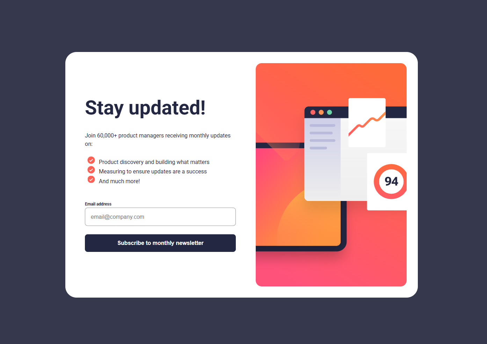
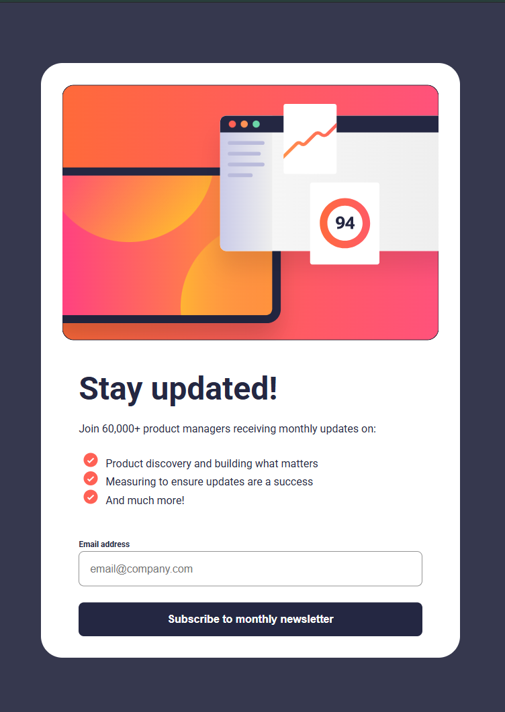
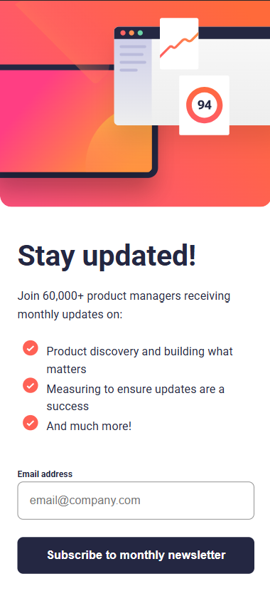

# Frontend Mentor - Newsletter sign-up form with success message solution

This is a solution to the [Newsletter sign-up form with success message challenge on Frontend Mentor](https://www.frontendmentor.io/challenges/newsletter-signup-form-with-success-message-3FC1AZbNrv). Frontend Mentor challenges help you improve your coding skills by building realistic projects. 

## Table of contents

- [Overview](#overview)
  - [The challenge](#the-challenge)
  - [Screenshot](#screenshot)
  - [Links](#links)
- [My process](#my-process)
  - [Built with](#built-with)
  - [What I learned](#what-i-learned)
  - [Continued development](#continued-development)
  - [Useful resources](#useful-resources)
- [Author](#author)
- [Acknowledgments](#acknowledgments)

**Note: Delete this note and update the table of contents based on what sections you keep.**

## Overview

### The challenge

Users should be able to:

- Add their email and submit the form
- See a success message with their email after successfully submitting the form
- See form validation messages if:
  - The field is left empty
  - The email address is not formatted correctly
- View the optimal layout for the interface depending on their device's screen size
- See hover and focus states for all interactive elements on the page

### Screenshot

### Links

- Solution URL: [https://github.com/faisalalmail/P3-CH2-newsletter-sign-up](https://github.com/faisalalmail/P3-CH2-newsletter-sign-up)
- Live Site URL: [https://p3-ch-2-newsletter-sign-up.vercel.app/](https://p3-ch-2-newsletter-sign-up.vercel.app/)

## My process

### Built with

- Semantic HTML5 markup
- CSS custom properties
- Flexbox
- Javascript
- Mobile-first workflow

### What I learned

**this time I am writing the challenges I run into in README file during work for 2 reasons**

1. so I can go ahead and work on something else and then return and fix instead of staying stuck.
2. keep a log of the challenges I run into.

*list* of challenges:
1. the thumbnail img not centering in the div in "mobile view" (large phone).
**solution** solved by adjusting the image size.

2. list text and bullets are not properly put in the same line (compared to the design).
*not solved*
3. so I kept wondering for a few minutes, why is my image on tablet view has a black border but I didnt set any border? I then realised its because its exported that way. Thank you designers `=(`

4. linear gradient for the submit button on hover showing white.
**solution**:use `background` property instead of `backgorund-color`

5. card size to look proportinally correct on desktop view
**solution** `flex-grow:1; flex-basis: 0;`, not really understand what it does, but it did the work.

6. vertically center the card in the page
**solution** I used ``main {height: 100vh; align-content: center;}``

## Author

My name is Faisal - A 35 year old guy from a small island in the middle of the world called Bahrain. I had the passion to code and practiced with html and PHP long ago. I stopped then, but the passion never died. and this could be my way to return.

- Instagram - [Faisal Almail](https://www.instagram.com/faisal.almail)
- Frontend Mentor - [@FaisalAlmail](https://www.frontendmentor.io/profile/faisalalmail)
